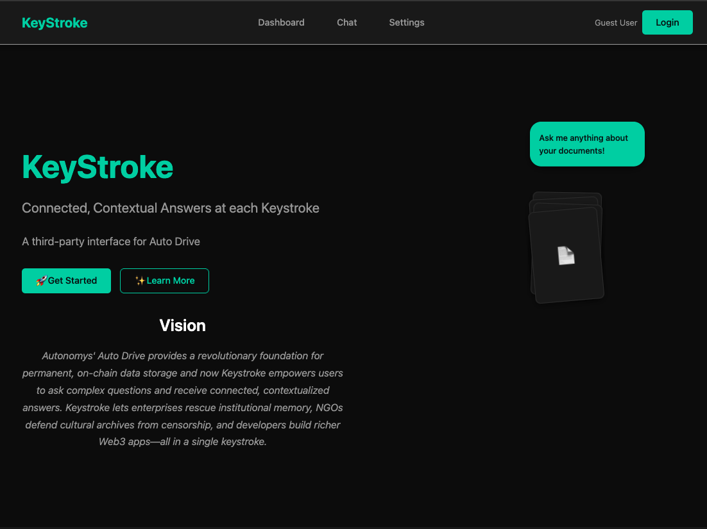
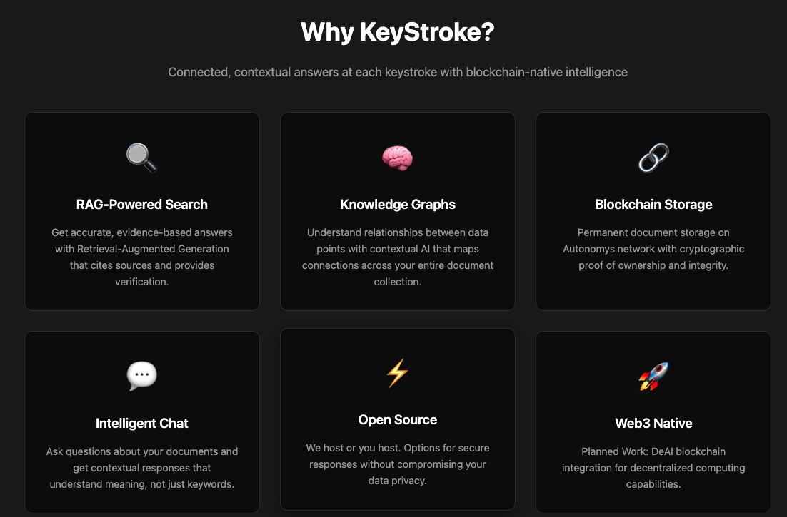
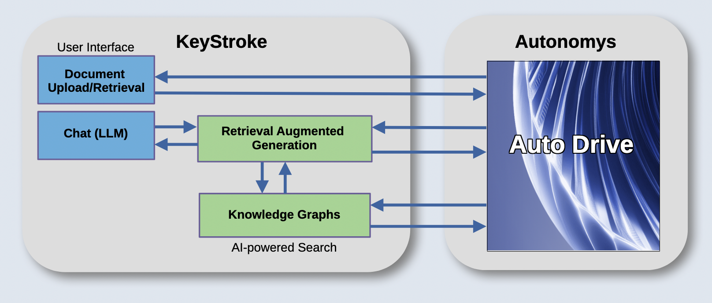
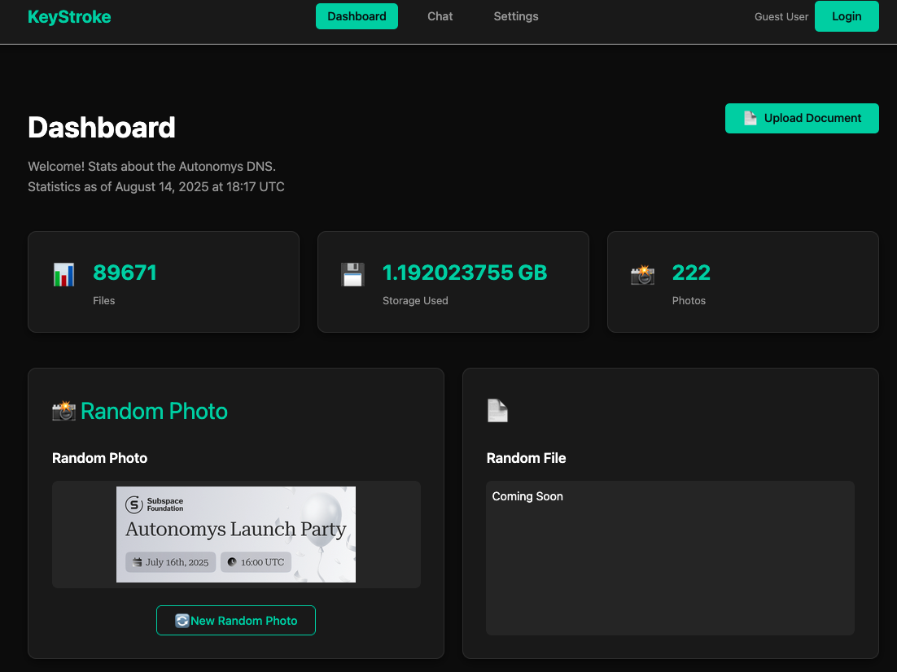
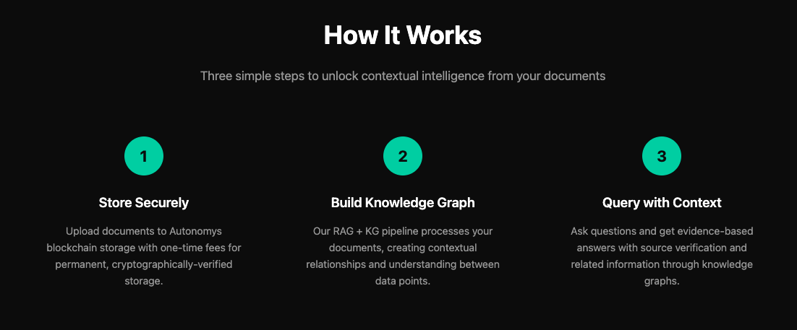
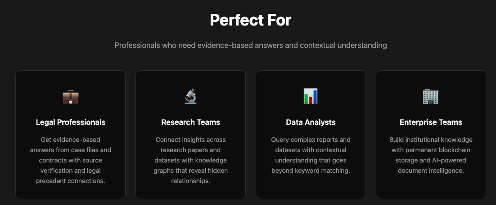

# KeyStroke

**Connected, Contextual Answers at each KeyStroke**

A User Interface (UI) for Autonomy's Auto Drive system combined with an LLM-powered chat interface backed with knowledge graphs for contextual understanding and retrieval-augmented generation (RAG) for accuracy and evidence of claim.



## Overview

KeyStroke is a blockchain-native search interface for Autonomys' growing database of multi-modal information in Auto Drive. It provides actionable information at each keystroke through intelligent, contextual AI-powered search that goes beyond traditional keyword search.

Autonomys provides the infrastructure to scale web3 applications by building permanent data storage with fast availability. A database of documents, images, transactions, and important information accessible anytime, anywhere. Information is only as good as the ability to find it. Keyword search is for web2.0; web3.0 needs connected, contextual AI-powered search.





## Features
### 📁 Document Archival
- **Secure Storage**: Permanent document storage with blockchain verification
- **One-Time Fee**: Forever storage on the Autonomys network
- **Cryptographic Proof**: Ownership and integrity verification
- **Decentralized Network**: No single point of failure
- **Multi-Modal Support**: Documents, images, transactions, and more
- **Direct API Integration**: Seamless connection to Autonomys AutoDrive



### 🔍 Knowledge Query (RAG + KG)
- **Retrieval-Augmented Generation (RAG)**: Get accurate, evidence-based answers to your questions
- **Knowledge Graphs (KG)**: Contextual understanding of relationships between data points
- **Intelligent Search**: Ask questions about your documents and get relevant responses
- **Evidence-Based Answers**: All responses include source verification and evidence
- **Future: deAI Integration**: Decentralized computing coming in future releases

## How It Wil Work 



## Use Cases



### Installation

1. **Clone the repository**
   ```bash
   git clone https://github.com/ReadyMouse/KeyStroke.git
   cd KeyStroke
   ```

2. **Install Jekyll dependencies**
   ```bash
   bundle install
   ```

3. **Set up Python processing pipeline** Not required for Demo site. 
   ```bash
   cd contracts/autodrive-read
   pip install -r requirements.txt
   ```

4. **Configure environment** Not required for Demo site. 
   ```bash
   # Add your AutoDrive credentials and backend configuration
   cp .env.example .env
   # Edit .env with your configuration
   ```

5. **Run the development server**
   ```bash
   bundle exec jekyll serve --livereload
   ```

## Development
### Project Structure
```
KeyStroke/
├── _includes/              # Jekyll includes/components
├── _layouts/              # Jekyll layout templates
├── _data/                 # Data files for Jekyll
├── assets/                # Static assets
│   ├── css/              # Stylesheets
│   ├── js/               # JavaScript files
│   └── images/           # Images and media
├── contracts/            # Smart contracts and backend
│   ├── query/            # Query-related contracts
│   └── autodrive-read/   # AutoDrive integration
└── docs/                 # Documentation
```
